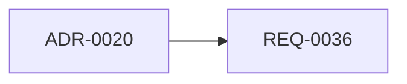

<!-- このファイルは /requirements-refine が要件から再生成します -->
<!-- 対象は priority が must / future で status が done でない要件 -->
<!-- 見積もり（estimate）は人間が入れてください。エージェントは TBD のままにします -->

現行版（v1.0）の実装済み要件（REQ-0001〜REQ-0035, priority: must / status: done）は WBS の対象外です。
以下は、棚卸しで `future`（次期フェーズ）に仕分けた要件です。`undecided` の要件（REQ-0038 / REQ-0039 / REQ-0040）は採否が確定した後にここへ載ります。

## マイルストーン

### 次期フェーズ（目標: 未定）

| REQ-ID | 領域 | 要件 | priority | status | 見積 | 依存 | 備考 |
|---|---|---|---|---|---|---|---|
| REQ-0036 | external-api | 受注元の管理画面・APIキー発行・有効無効切替 | future | not-started | TBD | ADR-0020 の決定 | APIキーの保存方式が ADR-0020 で未決。着手前に受入基準を確定 |
| REQ-0037 | auth | メーカーポータルのトークン自動更新（再ログイン不要化） | future | not-started | TBD | なし | 着手前に受入基準を確定 |

## 依存関係

## 並行実行可能な項目

- REQ-0037 は他要件に依存せず単独で着手できる（受入基準の確定後）。
- REQ-0036 は ADR-0020 の決定待ち。領域が異なる（external-api / auth）ため、決定後は REQ-0037 と並行実行できる。

## 見積もり未入力の項目

- REQ-0036, REQ-0037（いずれも estimate: TBD。人間の入力待ち）
