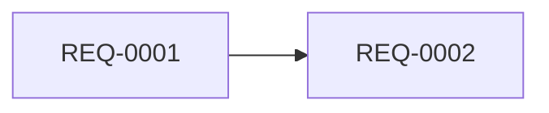

<!-- このファイルは /requirements-refine が要件から再生成します -->
<!-- 対象は priority が must / future で status が done でない要件 -->
<!-- 見積もり（estimate）は人間が入れてください。エージェントは TBD のままにします -->

## マイルストーン

### v1.0 — <名称>（目標: YYYY-MM-DD）

| REQ-ID | 領域 | 要件 | priority | status | 見積 | 依存 | 備考 |
|---|---|---|---|---|---|---|---|

## 依存関係

## 並行実行可能な項目

<!-- エージェントを並列で走らせられる単位。ファイル競合が起きない組み合わせを書く -->

## 見積もり未入力の項目

<!-- 人間の入力待ち -->
