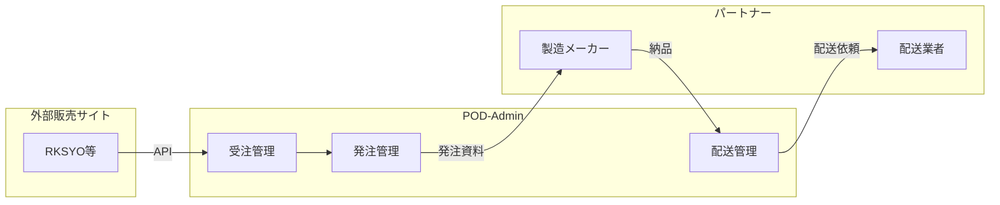
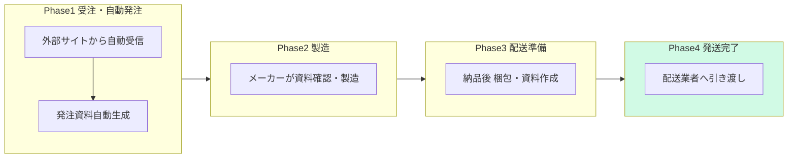
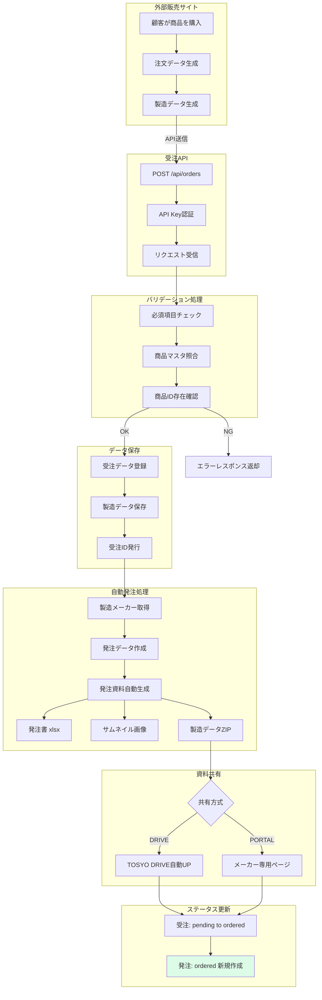
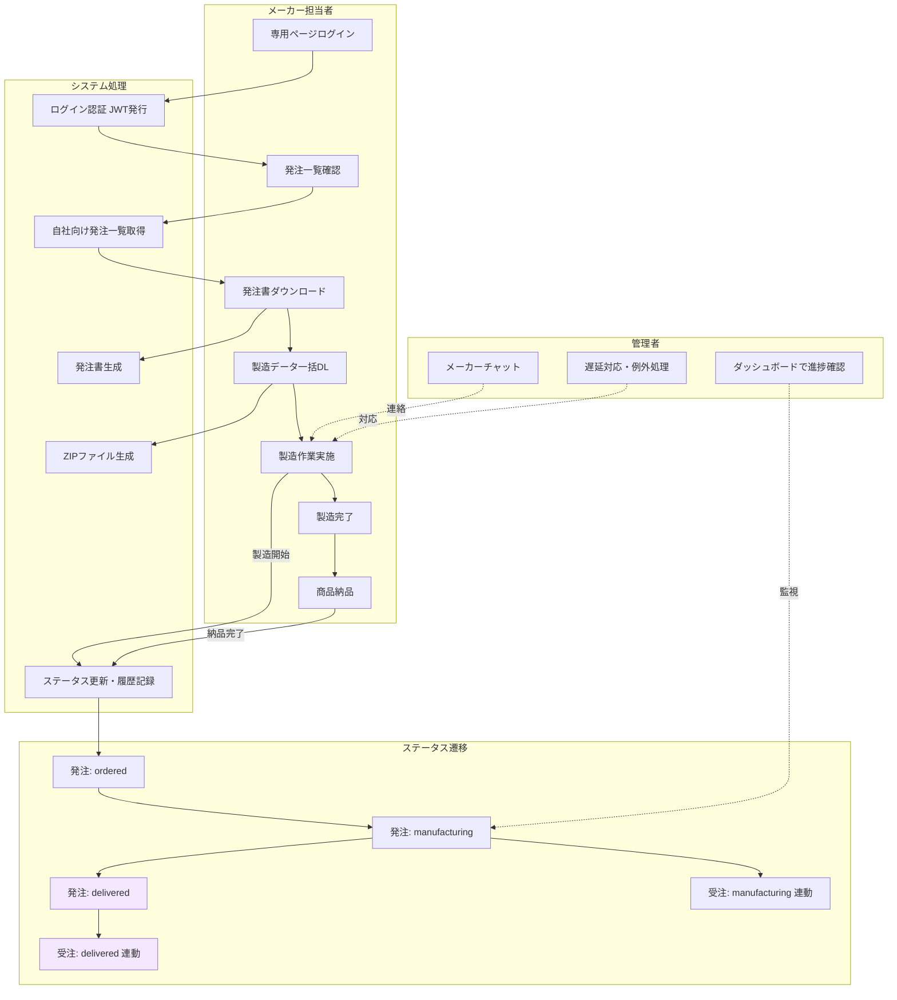
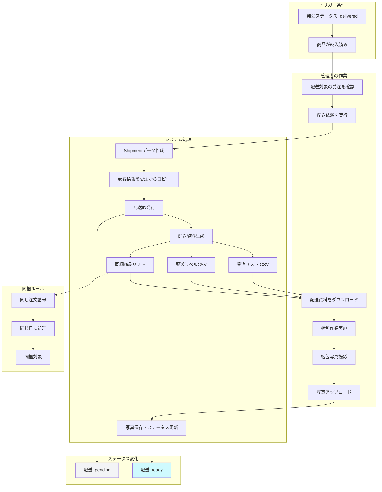
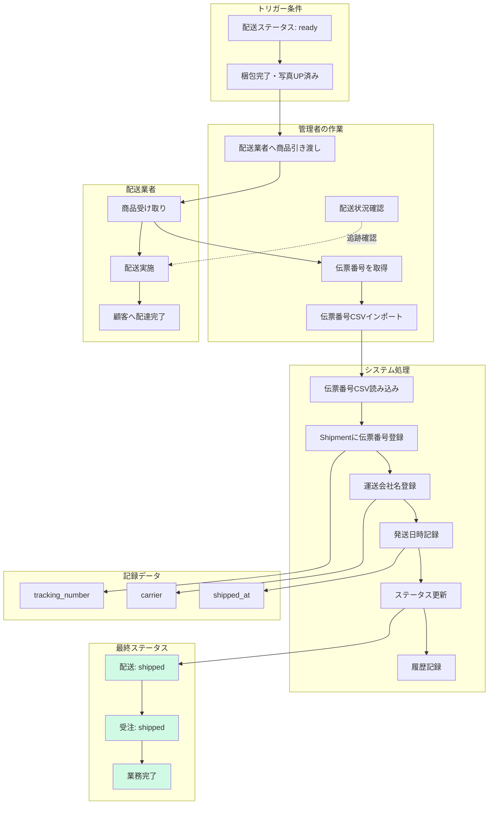
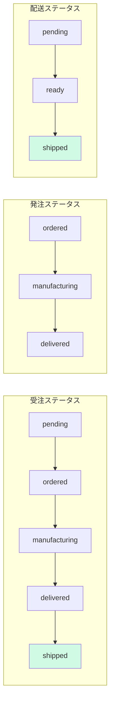
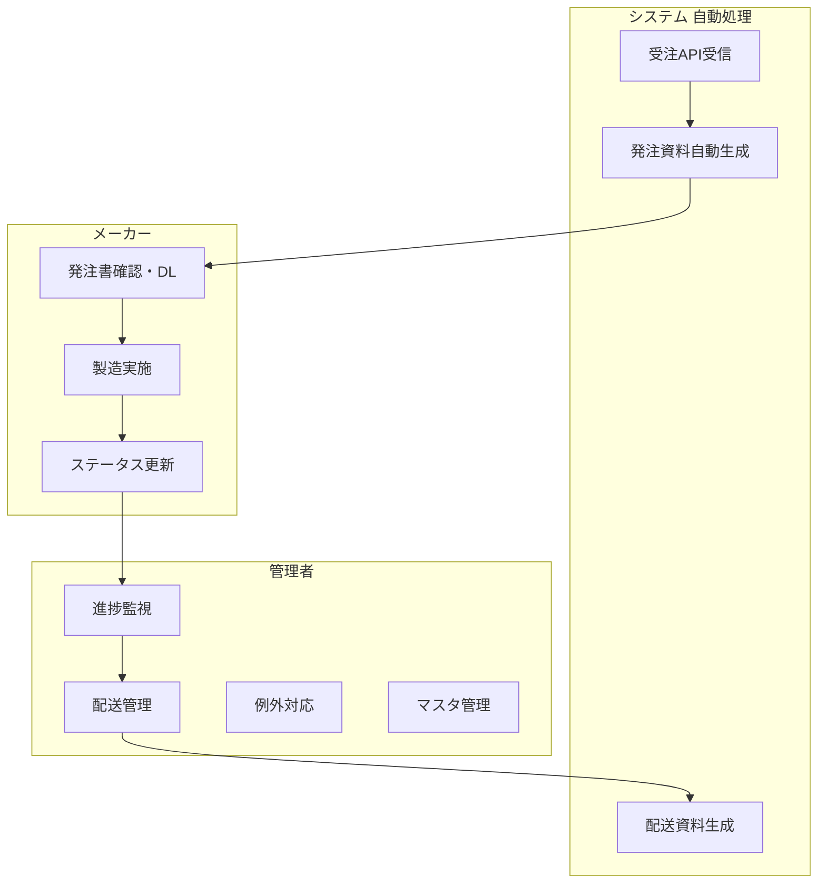

# PODグッズ受発注管理システム 業務フロー スライド要件定義

## 概要

- **目的**: PODグッズ受発注管理システムの業務フローを経営層向けに可視化
- **想定閲覧者**: 経営層・意思決定者
- **スライド枚数**: 全10枚
- **出力形式**: Googleスライド（16:9推奨）

---

## スライド構成一覧

| スライド番号 | タイトル | Mermaid図 | 主な内容 |
|-------------|---------|-----------|---------|
| 1 | タイトル | なし | システム名・サブタイトル |
| 2 | システム概要 | あり | 全体の位置づけと関係者 |
| 3 | 全体フロー（4フェーズ俯瞰） | あり | 受注から発送までの概要 |
| 4 | Phase 1: 受注・自動発注 | あり | 受注API〜発注資料自動生成 |
| 5 | Phase 2: 製造 | あり | メーカーの作業フロー |
| 6 | Phase 3: 配送準備 | あり | 納品後〜梱包完了 |
| 7 | Phase 4: 発送完了 | あり | 配送業者引き渡し〜完了 |
| 8 | ステータス遷移 | あり | 3つのステータス管理 |
| 9 | 役割分担 | あり | システム/メーカー/管理者 |
| 10 | まとめ・ビジネス価値 | なし | 導入効果・重要原則 |

---

## スライド1: タイトル

### 内容

```
【タイトル】
PODグッズ受発注管理システム
業務フロー

【サブタイトル】
受注から発送完了までの自動化

【補足情報（任意）】
- 作成日: YYYY年MM月
- 作成者: ○○部
```

### デザイン指針
- シンプルで視認性の高いレイアウト
- 会社ロゴを右上または左下に配置
- 背景色は白またはライトグレー

---

## スライド2: システム概要

### メッセージ
**外部販売サイトとメーカーをつなぐハブシステム**

### Mermaid図



### テキスト内容

```
【システムの役割】
外部販売サイトからの受注を自動で処理し、
メーカーへの発注・配送までを一元管理するシステム

【対象商品】
・アクリルキーホルダー
・アクリルスタンド
・ステッカー
・マグカップ
・Tシャツ

【関係者】
・外部販売サイト（RKSYO等）: 受注データ送信元
・本システム: 受発注・配送の自動化
・製造メーカー: 商品製造
・配送業者: 顧客への配送
```

---

## スライド3: 全体フロー（4フェーズ俯瞰）

### メッセージ
**受注から発送完了まで4つのフェーズで自動化**

### Mermaid図



### テキスト内容

```
【4フェーズの概要】

■ Phase 1: 受注・自動発注
  - 外部販売サイトからAPI経由で受注を自動受信
  - 発注資料（発注書・製造データ）を自動生成
  - メーカーへ即座に共有

■ Phase 2: 製造
  - メーカーが専用ページで発注内容を確認
  - 製造作業を実施
  - 完成品を納品

■ Phase 3: 配送準備
  - 納品された商品を確認
  - 配送資料を生成
  - 梱包作業を実施

■ Phase 4: 発送完了
  - 配送業者へ商品を引き渡し
  - 伝票番号を登録
  - 業務完了

【ポイント】
✓ 受注から発注資料生成まで完全自動
✓ メーカーは即座に製造開始可能
✓ 管理者は進捗監視と例外対応に集中
```

---

## スライド4: Phase 1 - 受注・自動発注（詳細）

### メッセージ
**受注と同時に発注資料を自動生成**

### Mermaid図



### テキスト内容

```
【Phase 1: 受注・自動発注】

■ トリガー
  外部販売サイトで顧客が商品を購入

■ 外部販売サイトの処理
  1. 注文データ生成（商品情報・顧客情報・注文番号）
  2. 製造データ生成（デザイン画像等）
  3. API送信

■ システム処理フロー
  1. API Key認証
  2. 必須項目チェック
     - 商品情報
     - 購入者情報（氏名・住所・電話番号）
     - 注文番号
  3. 商品マスタ照合（商品ID存在確認）
  4. 受注データ登録
  5. 製造データ保存（加工なし・そのまま保存）
  6. 受注ID発行
  7. 商品マスタから製造メーカーを自動取得
  8. 発注データ作成
  9. 発注資料自動生成
     - 発注書（xlsx形式）
     - サムネイル画像
     - 製造データZIP
  10. 共有方式に応じて資料配布
      - DRIVE: TOSYO DRIVEへ自動アップロード
      - PORTAL: メーカー専用ページに掲載

■ ステータス変化
  - 受注: pending → ordered
  - 発注: ordered（新規作成）

■ エラー処理
  - 商品IDが存在しない場合: エラーレスポンス返却
  - 必須項目不足の場合: エラーレスポンス返却
  - API認証失敗の場合: 401エラー返却
```

---

## スライド5: Phase 2 - 製造（詳細）

### メッセージ
**メーカーは専用ページで即座に製造開始可能**

### Mermaid図



### テキスト内容

```
【Phase 2: 製造】

■ メーカー担当者の作業フロー
  1. メーカー専用ページにログイン
  2. 自社向け発注一覧を確認
  3. 発注書をダウンロード（xlsx/csv形式選択可）
  4. 製造データを一括ダウンロード（ZIP形式）
  5. 製造作業を実施
  6. 製造完了後、商品を納品

■ システム処理フロー
  1. メーカー認証（JWT発行）
  2. 自社向け発注のみをフィルタリングして一覧表示
  3. 発注書をリアルタイム生成
  4. 製造データをZIP形式で提供
  5. ステータス更新時に履歴を記録

■ 管理者の作業
  - ダッシュボードで製造進捗を監視
  - メーカーチャット機能でコミュニケーション
  - 製造遅延発生時の例外対応

■ メーカー専用ページの機能
  - ログイン認証（メーカーID・パスワード）
  - 発注一覧表示（自社向けのみ）
  - 発注書ダウンロード（xlsx/csv）
  - 製造データ一括ダウンロード
  - ステータス更新（製造中への変更）
  - 備考入力（製造遅延等の報告）

■ ステータス変化
  【製造開始時】
  - 発注: ordered → manufacturing
  - 受注: ordered → manufacturing（連動）

  【納品完了時】
  - 発注: manufacturing → delivered
  - 受注: manufacturing → delivered（連動）
```

---

## スライド6: Phase 3 - 配送準備（詳細）

### メッセージ
**納品後、配送資料を自動生成し梱包作業を実施**

### Mermaid図



### テキスト内容

```
【Phase 3: 配送準備】

■ トリガー条件
  - 発注ステータスが「納入済（delivered）」
  - メーカーから商品が届いている状態

■ 管理者の作業フロー
  1. 配送対象の受注を確認
  2. 配送依頼を実行
  3. 配送資料をダウンロード
  4. 梱包作業を実施（同梱リストに従って）
  5. 梱包写真を撮影
  6. 写真をシステムにアップロード

■ システム処理フロー
  1. Shipmentデータ作成
  2. 顧客情報を受注データからコピー
     - 顧客名
     - 郵便番号
     - 住所
     - 電話番号
  3. 配送ID発行
  4. 配送資料自動生成
     - 受注リスト（配送代行PG用CSV）
     - 配送ラベルCSV（運送会社別フォーマット）
     - 同梱商品リスト（サムネイル画像付き）
  5. 梱包写真保存・ステータス更新

■ 同梱ルール
  以下の条件を両方満たす商品を同梱対象とする:
  1. 同じ注文番号で受注した商品
  2. その日に処理した注文のなかの商品

  ※異なる日に処理した場合は同梱しない

■ 配送資料の詳細
  【受注リスト（配送代行PG用CSV）】
  - 配送代行プログラムで読み込み可能な形式

  【配送ラベルCSV】
  - 各運送会社のフォーマットに対応
  - ヤマト運輸、佐川急便、日本郵便等

  【同梱商品リスト】
  - 注文番号ごとの商品一覧
  - サムネイル画像付きで視覚的に確認可能

■ ステータス変化
  - 配送依頼実行時: 配送 pending（配送準備中）
  - 写真アップロード後: 配送 ready（準備完了）
```

---

## スライド7: Phase 4 - 発送完了（詳細）

### メッセージ
**配送業者への引き渡しで業務完了**

### Mermaid図



### テキスト内容

```
【Phase 4: 発送完了】

■ トリガー条件
  - 配送ステータスが「準備完了（ready）」
  - 梱包完了・写真アップロード済み

■ 管理者の作業フロー
  1. 配送業者へ商品を引き渡し
  2. 配送業者から伝票番号を取得
  3. 伝票番号CSVをシステムにインポート
  4. 必要に応じて配送状況を追跡確認

■ 配送業者の作業
  1. 商品を受け取り
  2. 配送を実施
  3. 顧客へ配達完了

■ システム処理フロー
  1. 伝票番号CSVを読み込み
  2. Shipmentデータに伝票番号を登録
  3. 運送会社名を登録
  4. 発送日時を記録
  5. ステータスを更新
  6. 履歴を記録

■ 記録されるデータ
  - tracking_number: 伝票番号（追跡用）
  - carrier: 運送会社名
  - shipped_at: 発送日時

■ 伝票番号CSVフォーマット
  - 注文番号と伝票番号の紐付け
  - 一括インポート対応

■ 最終ステータス
  - 配送: shipped（発送完了）
  - 受注: shipped（発送完了）

  → すべてのステータスが「shipped」になり業務完了
```

---

## スライド8: ステータス遷移

### メッセージ
**3つのステータスで全工程の進捗を見える化**

### Mermaid図



### テキスト内容

```
【ステータス管理】

■ 受注ステータス（Order）
  | コード | 表示名 | 説明 |
  |--------|--------|------|
  | pending | 配送準備中 | 受注登録完了、発注前 |
  | ordered | 発注準備中 | メーカーへ発注完了 |
  | manufacturing | 製造中 | メーカーが製造中 |
  | delivered | 納入済 | メーカーから納品完了 |
  | shipped | 発送完了 | 配送業者へ引き渡し完了（最終） |

■ 発注ステータス（PurchaseOrder）
  | コード | 表示名 | 説明 |
  |--------|--------|------|
  | ordered | 発注準備中 | メーカーへ発注完了 |
  | manufacturing | 製造中 | メーカーが製造を開始 |
  | delivered | 納入済 | メーカーから納品完了（最終） |

■ 配送ステータス（Shipment）
  | コード | 表示名 | 説明 |
  |--------|--------|------|
  | pending | 配送準備中 | 配送依頼済み、梱包待ち |
  | ready | 準備完了 | 梱包完了、発送待ち |
  | shipped | 発送完了 | 配送業者へ引き渡し完了（最終） |

■ ステータス連動
  発注ステータスの更新に連動して受注ステータスも自動更新
  - 発注: manufacturing → 受注: manufacturing
  - 発注: delivered → 受注: delivered

■ 最終ゴール
  すべてのステータスが「shipped」または「delivered」になり業務完了
```

---

## スライド9: 役割分担

### メッセージ
**システム自動化により管理者の負担を軽減**

### Mermaid図



### テキスト内容

```
【役割分担】

■ システム（自動処理）
  | 処理 | 説明 |
  |------|------|
  | 受注API受信 | 外部サイトからの受注を自動受信 |
  | 発注資料自動生成 | 発注書・サムネイル・製造データZIP |
  | 配送資料生成 | 受注リスト・ラベルCSV・同梱リスト |

■ メーカー担当者
  | 作業 | 説明 |
  |------|------|
  | 発注書確認・DL | 専用ページで発注内容を確認 |
  | 製造実施 | 製造データを元に商品を製造 |
  | ステータス更新 | 製造中・納入済を報告 |

■ 管理者（社内オペレーター）
  | 作業 | 説明 |
  |------|------|
  | 進捗監視 | ダッシュボードで全体進捗を確認 |
  | 配送管理 | 梱包・写真UP・伝票番号登録 |
  | 例外対応 | 遅延・エラー発生時の対応 |
  | マスタ管理 | 商品・メーカー情報の登録更新 |

■ 自動化による効果
  ✓ 受注 → 発注資料生成が完全自動（人手不要）
  ✓ メーカーは専用ページで即座に確認可能
  ✓ 管理者は監視・配送・例外対応に専念
```

---

## スライド10: まとめ・ビジネス価値

### メッセージ
**受注から発注まで完全自動化で業務効率を最大化**

### テキスト内容

```
【まとめ・ビジネス価値】

■ 導入効果
  ┌────────────┬────────────────────────────┐
  │ 項目       │ 効果                        │
  ├────────────┼────────────────────────────┤
  │ 受注→発注  │ 完全自動化（人手不要）       │
  │ 発注資料   │ 受注と同時に自動生成         │
  │ メーカー   │ 即座に製造開始可能           │
  │ 管理者    │ 進捗監視と例外対応に専念      │
  │ 処理能力   │ 1日1,000件/月間10,000件以上  │
  └────────────┴────────────────────────────┘

■ 重要原則
  1. 受注データは自動で発注資料に変換
  2. 製造データは加工せずそのままメーカーへ
  3. 全工程でステータス管理

■ セキュリティ
  - 受注API: API Key認証
  - 管理者: JWT認証
  - メーカー専用ページ: ログイン認証

■ 対応商品
  - アクリルキーホルダー
  - アクリルスタンド
  - ステッカー
  - マグカップ
  - Tシャツ

■ 今後の展望
  - TOSYO DRIVE連携の強化
  - 配送追跡のリアルタイム連携
  - 分析ダッシュボードの拡充
```

---

## 付録: デザインガイドライン

### 色の統一ルール

| 状態 | 色 | Hex | 用途 |
|-----|-----|------|------|
| 待機中 | グレー | #F3F4F6 | pending状態 |
| 進行中 | 緑 | #DCFCE7 | ordered状態 |
| 作業中 | 青 | #DBEAFE | manufacturing状態 |
| 完了待ち | 紫 | #F3E8FF | delivered状態 |
| 準備完了 | シアン | #CFFAFE | ready状態 |
| 最終完了 | エメラルド | #D1FAE5 | shipped状態 |

### フォント推奨

- 日本語: Noto Sans JP または ヒラギノ角ゴ
- タイトル: 24-28pt、太字
- 本文: 14-18pt、標準
- 注釈: 12pt、グレー

### レイアウト原則

1. 1スライド1メッセージを徹底
2. 余白を十分に確保（最低20px）
3. 図は左側、テキストは右側（または上下配置）
4. 重要な情報は上部に配置

### Mermaid図の画像化手順

1. https://mermaid.live/ にアクセス
2. 本ドキュメントのMermaidコードをコピー
3. 貼り付けて右側でプレビュー確認
4. 「Actions」→「PNG」または「SVG」でダウンロード
5. 解像度: 2x推奨（高解像度）
6. 背景色: 透明または白

---

## 更新履歴

| 日付 | 更新内容 |
|------|---------|
| 2026-01-03 | 初版作成 |
| 2026-01-03 | Mermaid図の構文エラーを修正（絵文字・括弧・日本語subgraph名を除去） |
